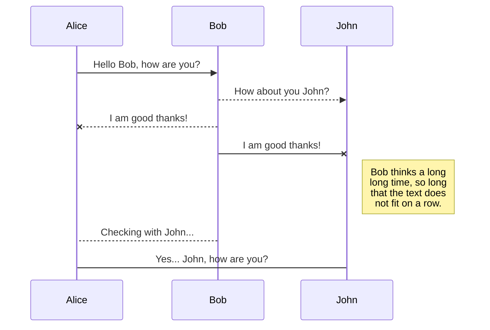
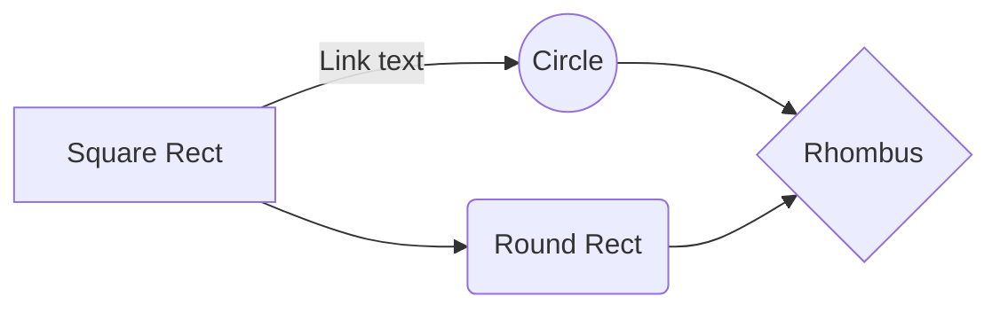

# uqaleo.github.io
Berbagi informasi dengan korelasi positif

**bold text**

_italic text_

[text](url)

`inline fixed-width code`

```pre-formatted fixed-width code block```

> Ini adalah kutipan.
> 
> Bisa beberapa baris.

Ketik `print("Hello, World!")` untuk mencetak teks.

- [x] Belajar Markdown
- [ ] Membuat dokumentasi
- [ ] Publikasi ke GitHub

> Ini adalah kutipan utama.
> **Teks tambahan** yang dijelaskan lebih lanjut.

<font color="red">This text is red!</font>

<p style="color:blue">Make this text blue.</p>

Here's a paragraph that will be visible.

[This is a comment that will be hidden.]: # 

And here's another paragraph that's visible.

> :warning: **Warning:** Do not push the big red button.

> :memo: **Note:** Sunrises are beautiful.

> :bulb: **Tip:** Remember to appreciate the little things in life.

> [!NOTE]
> Useful information that users should know, even when skimming content.

> [!TIP]
> Helpful advice for doing things better or more easily.

> [!IMPORTANT]
> Key information users need to know to achieve their goal.

> [!WARNING]
> Urgent info that needs immediate user attention to avoid problems.

> [!CAUTION]
> Advises about risks or negative outcomes of certain actions.

The background color is `#ffffff` for light mode and `#000000` for dark mode.

## UML diagrams

You can render UML diagrams using [Mermaid](https://mermaidjs.github.io/). For example, this will produce a sequence diagram:



And this will produce a flow chart:



* Fruit
  * Apple
  * Orange
  * Banana
* Dairy
  * Milk
  * Cheese
 
1. Ingredients

    - spaghetti
    - marinara sauce
    - salt

2. Cooking

   Bring water to boil, add a pinch of salt and spaghetti. Cook until pasta is **tender**.

3. Serve

   Drain the pasta on a plate. Add heated sauce. 

   > No man is lonely eating spaghetti; it requires so much attention.

   Bon appetit!


