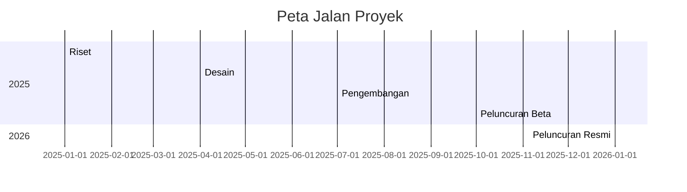
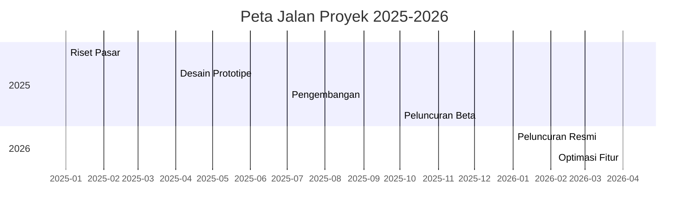
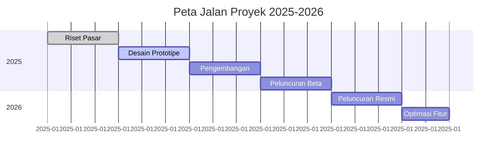

# Peta Jalan Trading atau Peta Jalan Berburu Pip (Price in poin)

# Peta Jalan Proyek

# Peta Jalan Proyek

### Penjelasan Kode
- **`title`**: Judul diagram (misalnya, "Peta Jalan Proyek 2025-2026").
- **`dateFormat`**: Format tanggal untuk input (misalnya, `YYYY-MM` untuk tahun dan bulan).
- **`axisFormat`**: Format tampilan sumbu waktu (misalnya, `%Y-%m` untuk menampilkan tahun-bulan).
- **`section`**: Mengelompokkan tahapan berdasarkan kategori atau tahun (misalnya, "2025" dan "2026").
- **Tugas**: Formatnya adalah `Nama Tugas :ID, tanggal_mulai, durasi`. Contoh:
  - `Riset Pasar :a1, 2025-01, 3m` berarti tugas "Riset Pasar" dimulai Januari 2025 dengan durasi 3 bulan.
  - `a1` adalah ID unik untuk tugas.
  - Durasi bisa ditulis dalam `d` (hari), `w` (minggu), atau `m` (bulan).

### Hasil Visual
Jika platform mendukung Mermaid (seperti GitHub, GitLab, atau editor Markdown tertentu), kode di atas akan menghasilkan diagram Gantt seperti ini:
- Sumbu horizontal menunjukkan waktu (misalnya, Jan 2025 hingga Jun 2026).
- Setiap tahapan digambarkan sebagai bilah (bar) dengan panjang sesuai durasi.
- Section (2025, 2026) memisahkan tahapan secara visual.

### Variasi Tambahan
Kamu bisa menambahkan detail seperti status tugas atau ketergantungan antar tugas.

**Contoh dengan Status dan Ketergantungan:**

markdown
# Peta Jalan Proyek dengan Status

**Penjelasan Tambahan:**
- **`done`**: Menandakan tugas selesai (bilah akan ditampilkan berbeda, misalnya, diisi penuh).
- **`active`**: Menandakan tugas sedang berlangsung.
- **`after a1`**: Menunjukkan tugas dimulai setelah tugas dengan ID `a1` selesai (ketergantungan).
- Ini berguna untuk menunjukkan urutan tugas secara visual.

### Tips
- **Platform yang Mendukung Mermaid**: Pastikan platform yang kamu gunakan (seperti GitHub atau plugin di VS Code) mendukung Mermaid. Jika tidak, kamu bisa melihat pratinjau di editor seperti [Mermaid Live Editor](https://mermaid.live/).
- **Kustomisasi Durasi**: Sesuaikan durasi (misalnya, `2m` untuk 2 bulan, `30d` untuk 30 hari) sesuai kebutuhan.
- **Detail Tugas**: Tambahkan deskripsi singkat atau milestone dengan sintaks seperti `Milestone Nama :milestone, tanggal`.
- **Contoh Milestone**:

## Peta Jalan Pikiran Berburu Pip
- Berpikir berkeinginan untuk mendapatkan uang di kegiatan trading/berburu pip
- Momentum yang mendukung atau kurang mendukung untuk melaksanakan kegiatan trading/berburu pip

