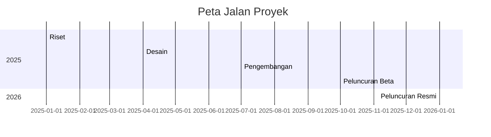
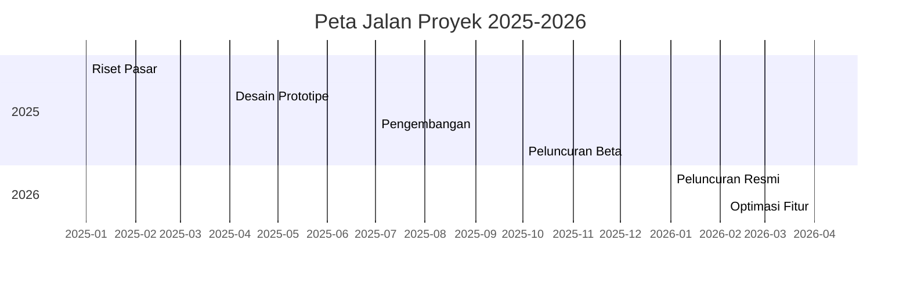
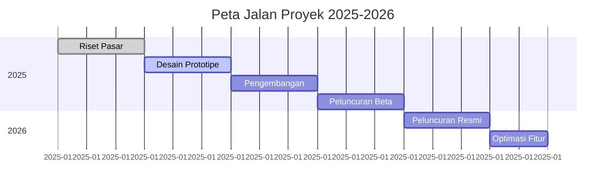

# Peta Jalan Trading atau Peta Jalan Berburu Pip (Price in poin)

# Peta Jalan Proyek



# Peta Jalan Proyek




### Penjelasan Kode
- **`title`**: Judul diagram (misalnya, "Peta Jalan Proyek 2025-2026").
- **`dateFormat`**: Format tanggal untuk input (misalnya, `YYYY-MM` untuk tahun dan bulan).
- **`axisFormat`**: Format tampilan sumbu waktu (misalnya, `%Y-%m` untuk menampilkan tahun-bulan).
- **`section`**: Mengelompokkan tahapan berdasarkan kategori atau tahun (misalnya, "2025" dan "2026").
- **Tugas**: Formatnya adalah `Nama Tugas :ID, tanggal_mulai, durasi`. Contoh:
  - `Riset Pasar :a1, 2025-01, 3m` berarti tugas "Riset Pasar" dimulai Januari 2025 dengan durasi 3 bulan.
  - `a1` adalah ID unik untuk tugas.
  - Durasi bisa ditulis dalam `d` (hari), `w` (minggu), atau `m` (bulan).

### Hasil Visual
Jika platform mendukung Mermaid (seperti GitHub, GitLab, atau editor Markdown tertentu), kode di atas akan menghasilkan diagram Gantt seperti ini:
- Sumbu horizontal menunjukkan waktu (misalnya, Jan 2025 hingga Jun 2026).
- Setiap tahapan digambarkan sebagai bilah (bar) dengan panjang sesuai durasi.
- Section (2025, 2026) memisahkan tahapan secara visual.

### Variasi Tambahan
Kamu bisa menambahkan detail seperti status tugas atau ketergantungan antar tugas.

**Contoh dengan Status dan Ketergantungan:**

markdown
# Peta Jalan Proyek dengan Status




**Penjelasan Tambahan:**
- **`done`**: Menandakan tugas selesai (bilah akan ditampilkan berbeda, misalnya, diisi penuh).
- **`active`**: Menandakan tugas sedang berlangsung.
- **`after a1`**: Menunjukkan tugas dimulai setelah tugas dengan ID `a1` selesai (ketergantungan).
- Ini berguna untuk menunjukkan urutan tugas secara visual.

### Tips
- **Platform yang Mendukung Mermaid**: Pastikan platform yang kamu gunakan (seperti GitHub atau plugin di VS Code) mendukung Mermaid. Jika tidak, kamu bisa melihat pratinjau di editor seperti [Mermaid Live Editor](https://mermaid.live/).
- **Kustomisasi Durasi**: Sesuaikan durasi (misalnya, `2m` untuk 2 bulan, `30d` untuk 30 hari) sesuai kebutuhan.
- **Detail Tugas**: Tambahkan deskripsi singkat atau milestone dengan sintaks seperti `Milestone Nama :milestone, tanggal`.
- **Contoh Milestone**:

## Peta Jalan Pikiran Berburu Pip
- Berpikir berkeinginan untuk mendapatkan uang di kegiatan trading/berburu pip
- Momentum yang mendukung atau kurang mendukung untuk melaksanakan kegiatan trading/berburu pip

# Peta jalan Trading (Berburu Pip)

# Peta Jalan Trading Harian: Berburu Pip (24 Jam)

```mermaid
gantt
    title Peta Jalan Trading Harian untuk Berburu Pip
    dateFormat  HH:mm
    axisFormat  %H:%M
    tickInterval 2hour

    section Persiapan (Pagi)
    Analisis Pasar         :a1, 06:00, 1h
    Identifikasi Setup     :a2, after a1, 1h
    Rencana Trading        :a3, after a2, 30m

    section Eksekusi (Siang-Sore)
    Trading Sesi Asia      :a4, 08:30, 2h
    Trading Sesi London    :a5, 13:00, 3h
    Trading Sesi New York  :a6, after a5, 3h

    section Evaluasi (Malam)
    Review Trading         :a7, 21:00, 1h
    Jurnal Trading         :a8, after a7, 30m
    Persiapan Hari Berikut :a9, after a8, 30m
    Milestone: Target Pip Harian :milestone, a10, 23:00, 0m
```

### Penjelasan Peta Jalan
Peta jalan ini dirancang untuk trader yang ingin mengejar pip dalam satu hari (24 jam) dengan strategi day trading atau scalping. Jadwal disusun berdasarkan zona waktu WIB (Waktu Indonesia Barat, UTC+7) pada tanggal 28 Agustus 2025, dengan fokus pada sesi pasar forex utama. Berikut rincian tahapan:

#### 1. **Persiapan (Pagi, 06:00-08:30 WIB)**
- **Analisis Pasar (06:00-07:00)**: Tinjau pergerakan harga pair mayor (misalnya, EUR/USD, GBP/USD) menggunakan analisis teknikal (support/resistance, indikator RSI, Moving Average) dan cek berita ekonomi (misalnya, data PMI atau suku bunga). Tujuannya adalah mengidentifikasi peluang pip berdasarkan volatilitas.
- **Identifikasi Setup (07:00-08:00)**: Cari setup trading seperti breakout atau pullback di timeframe rendah (M15 atau M30). Contoh: Targetkan 10-20 pip per trade untuk scalping.
- **Rencana Trading (08:00-08:30)**: Tentukan entry point, stop loss (misalnya, 10 pip), dan take profit (misalnya, 20 pip) berdasarkan risk-reward ratio 1:2. Siapkan daftar pair yang akan ditrading.

#### 2. **Eksekusi Trading (Siang-Sore, 08:30-19:00 WIB)**
- **Trading Sesi Asia (08:30-10:30)**: Fokus pada pair dengan yen (misalnya, USD/JPY) karena sesi Asia aktif. Volatilitas rendah, cocok untuk scalping pip kecil (5-10 pip per trade).
- **Trading Sesi London (13:00-16:00)**: Sesi London (mulai 13:00 WIB) memiliki volatilitas tinggi, ideal untuk pair seperti EUR/USD atau GBP/USD. Targetkan 20-50 pip per trade dengan day trading atau scalping.
- **Trading Sesi New York (16:00-19:00)**: Sesi New York tumpang tindih dengan London (16:00-18:00 WIB) adalah waktu paling volatil. Fokus pada breakout atau news trading untuk mengejar 30-60 pip.

#### 3. **Evaluasi (Malam, 21:00-23:00 WIB)**
- **Review Trading (21:00-22:00)**: Analisis hasil trading: berapa pip yang didapat, apakah sesuai target (misalnya, 50-100 pip harian), dan apa yang bisa diperbaiki.
- **Jurnal Trading (22:00-22:30)**: Catat detail trade (entry, exit, pip profit/loss, alasan keputusan) untuk melacak performa dan emosi.
- **Persiapan Hari Berikut (22:30-23:00)**: Tinjau kalender ekonomi untuk hari berikutnya (misalnya, laporan NFP atau keputusan suku bunga) dan sesuaikan strategi.
- **Milestone: Target Pip Harian (23:00)**: Capai target pip harian, misalnya, 50-100 pip untuk scalping atau 100-200 pip untuk day trading.

### Hasil Visual
Jika dirender di platform yang mendukung Mermaid (seperti [Mermaid Live Editor](https://mermaid.live/) atau GitHub), kode ini akan menghasilkan diagram Gantt dengan:
- Sumbu waktu dari 06:00 hingga 23:00 WIB, dengan interval 2 jam.
- Bilah untuk setiap tahap (analisis, trading, evaluasi) dengan durasi dalam jam atau menit.
- Milestone di akhir (23:00) menandakan pencapaian target pip harian.

### Tips untuk Berburu Pip Harian
- **Pilih Pair Mayor**: EUR/USD, GBP/USD, atau USD/JPY memiliki spread rendah (1-2 pip) dan volatilitas tinggi, ideal untuk scalping atau day trading.
- **Manajemen Risiko**: Batasi risiko per trade (1-2% dari modal). Misalnya, dengan modal $1000, risiko per trade $10-$20, stop loss 10 pip, target profit 20 pip.
- **Fokus pada Sesi Volatil**: Sesi London (13:00-16:00 WIB) dan overlap London-New York (16:00-18:00 WIB) menawarkan pergerakan pip besar.
- **Gunakan Timeframe Rendah**: Untuk scalping, gunakan M5 atau M15; untuk day trading, gunakan M30 atau H1.
- **Pantau Berita**: Gunakan kalender ekonomi (misalnya, dari Forexfactory.com) untuk menghindari trading saat rilis berita berdampak tinggi, kecuali jika strategi news trading.
- **Target Realistis**: Scalping bisa menargetkan 10-20 pip per trade (3-5 trade/hari), sedangkan day trading menargetkan 50-100 pip per hari.

### Catatan
- **Zona Waktu**: Jadwal di atas menggunakan WIB (UTC+7). Jika kamu berada di zona waktu lain, sesuaikan waktu sesi pasar (misalnya, sesi London mulai 07:00 EST atau 20:00 JST).
- **Platform**: Pastikan platform Markdown mendukung Mermaid. Jika tidak, render di [Mermaid Live Editor](https://mermaid.live/) dan sematkan gambar dengan ``.
- **Kustomisasi**: Jika kamu punya preferensi spesifik (misalnya, pair tertentu seperti XAU/USD, strategi scalping saja, atau target pip tertentu), beri tahu saya, dan saya akan sesuaikan kode Mermaid-nya.
- **Sumber**: Informasi sesi pasar dan strategi pip berdasarkan praktik umum trading forex dari sumber seperti,,, dan.

Apakah kamu ingin saya menyesuaikan peta jalan ini dengan pair spesifik (misalnya, EUR/USD saja), strategi tertentu (scalping/day trading), atau target pip harian tertentu? Beri tahu detailnya!

_Penyangkalan: Grok bukan penasihat keuangan; silakan konsultasikan dengan satu. Jangan bagikan informasi yang dapat mengidentifikasi Anda._


