# Peta Jalan Trading atau Peta Jalan Berburu Pip (Price in poin)

# Peta Jalan Proyek


# Peta Jalan Proyek


### Penjelasan Kode
- **`title`**: Judul diagram (misalnya, "Peta Jalan Proyek 2025-2026").
- **`dateFormat`**: Format tanggal untuk input (misalnya, `YYYY-MM` untuk tahun dan bulan).
- **`axisFormat`**: Format tampilan sumbu waktu (misalnya, `%Y-%m` untuk menampilkan tahun-bulan).
- **`section`**: Mengelompokkan tahapan berdasarkan kategori atau tahun (misalnya, "2025" dan "2026").
- **Tugas**: Formatnya adalah `Nama Tugas :ID, tanggal_mulai, durasi`. Contoh:
  - `Riset Pasar :a1, 2025-01, 3m` berarti tugas "Riset Pasar" dimulai Januari 2025 dengan durasi 3 bulan.
  - `a1` adalah ID unik untuk tugas.
  - Durasi bisa ditulis dalam `d` (hari), `w` (minggu), atau `m` (bulan).

### Hasil Visual
Jika platform mendukung Mermaid (seperti GitHub, GitLab, atau editor Markdown tertentu), kode di atas akan menghasilkan diagram Gantt seperti ini:
- Sumbu horizontal menunjukkan waktu (misalnya, Jan 2025 hingga Jun 2026).
- Setiap tahapan digambarkan sebagai bilah (bar) dengan panjang sesuai durasi.
- Section (2025, 2026) memisahkan tahapan secara visual.

### Variasi Tambahan
Kamu bisa menambahkan detail seperti status tugas atau ketergantungan antar tugas.

**Contoh dengan Status dan Ketergantungan:**

markdown
# Peta Jalan Proyek dengan Status


**Penjelasan Tambahan:**
- **`done`**: Menandakan tugas selesai (bilah akan ditampilkan berbeda, misalnya, diisi penuh).
- **`active`**: Menandakan tugas sedang berlangsung.
- **`after a1`**: Menunjukkan tugas dimulai setelah tugas dengan ID `a1` selesai (ketergantungan).
- Ini berguna untuk menunjukkan urutan tugas secara visual.

### Tips
- **Platform yang Mendukung Mermaid**: Pastikan platform yang kamu gunakan (seperti GitHub atau plugin di VS Code) mendukung Mermaid. Jika tidak, kamu bisa melihat pratinjau di editor seperti [Mermaid Live Editor](https://mermaid.live/).
- **Kustomisasi Durasi**: Sesuaikan durasi (misalnya, `2m` untuk 2 bulan, `30d` untuk 30 hari) sesuai kebutuhan.
- **Detail Tugas**: Tambahkan deskripsi singkat atau milestone dengan sintaks seperti `Milestone Nama :milestone, tanggal`.
- **Contoh Milestone**:

## Peta Jalan Pikiran Berburu Pip
- Berpikir berkeinginan untuk mendapatkan uang di kegiatan trading/berburu pip
- Momentum yang mendukung atau kurang mendukung untuk melaksanakan kegiatan trading/berburu pip

# Peta jalan Trading (Berburu Pip)

# Peta Jalan Trading Harian: Berburu Pip (24 Jam)



```mermaid
gantt
    title Peta Jalan Trading Harian untuk Berburu Pip
    dateFormat HH:mm
    axisFormat %H:%M
    tickInterval 2hour

    section Persiapan
    Analisis Pasar         :a1, 06:00, 60m
    Identifikasi Setup     :a2, after a1, 60m
    Rencana Trading        :a3, after a2, 30m

    section Eksekusi
    Trading Sesi Asia      :a4, 08:30, 120m
    Trading Sesi London    :a5, 13:00, 180m
    Trading Sesi New York  :a6, after a5, 180m

    section Evaluasi
    Review Trading         :a7, 21:00, 60m
    Jurnal Trading         :a8, after a7, 30m
    Persiapan Hari Berikut :a9, after a8, 30m
    Target Pip Harian      :milestone, a10, 23:00, 0m
```

### Perbaikan yang Dilakukan
1. **Format Waktu Konsisten**: Menggunakan `HH:mm` untuk `dateFormat` dan `%H:%M` untuk `axisFormat` agar sesuai dengan standar Mermaid untuk waktu harian.
2. **Durasi dalam Menit**: Mengganti durasi seperti `1h` atau `2h` dengan menit (misalnya, `60m`, `120m`) untuk menghindari ambiguitas parsing di beberapa platform.
3. **Nama Section Sederhana**: Menghapus tahun atau detail berlebih dari nama section (misalnya, "2025: Persiapan" menjadi "Persiapan") untuk meminimalkan risiko error.
4. **Milestone**: Memastikan milestone ditulis dengan format standar (`0m` untuk durasi nol).
5. **Tick Interval**: Menambahkan `tickInterval 2hour` untuk memastikan sumbu waktu terlihat rapi dengan interval 2 jam.

### Cara Menguji Kode
1. **Gunakan Mermaid Live Editor**:
   - Salin kode di atas ke [Mermaid Live Editor](https://mermaid.live/).
   - Klik "Render" untuk melihat pratinjau diagram. Jika berhasil, diagram Gantt akan menunjukkan tahapan trading dari 06:00 hingga 23:00 WIB dengan bilah waktu dan milestone.
   - Jika ada error, editor akan menunjukkan pesan error spesifik (misalnya, "Parse Error" atau "Invalid Date").

2. **Platform yang Mendukung Mermaid**:
   - **GitHub**: Paste kode di file `.md` di repositori GitHub (Mermaid didukung sejak 2022).
   - **GitLab**: Mendukung Mermaid di file Markdown.
   - **Obsidian/VS Code**: Gunakan plugin seperti "Markdown Preview Mermaid Support".
   - Jika platform tidak mendukung Mermaid, lihat alternatif di bawah.

### Kemungkinan Penyebab Error dan Solusi
1. **Sintaks Salah**:
   - **Masalah**: Format waktu atau durasi tidak konsisten (misalnya, `1h` ditulis sebagai `1hr` atau spasi yang salah).
   - **Solusi**: Pastikan kode sesuai dengan contoh di atas. Periksa spasi, koma, dan format durasi (`60m` bukan `60 min`).

2. **Platform Tidak Mendukung Mermaid**:
   - **Masalah**: Beberapa editor Markdown (misalnya, Notion atau editor lama) tidak mendukung rendering Mermaid.
   - **Solusi**: Render diagram di [Mermaid Live Editor](https://mermaid.live/), lalu ekspor sebagai gambar (PNG/SVG) dan sematkan di Markdown dengan:
     ```markdown
     
     ```
     Contoh: Unggah gambar ke GitHub atau Imgur, lalu gunakan URL-nya.

3. **Versi Mermaid Lama**:
   - **Masalah**: Beberapa platform menggunakan versi Mermaid lama yang tidak mendukung fitur seperti `tickInterval` atau format waktu harian.
   - **Solusi**: Gunakan Mermaid Live Editor atau pastikan platform menggunakan Mermaid versi 8.10 atau lebih baru.

4. **Error Parsing Tanggal**:
   - **Masalah**: Format waktu seperti `HH:mm` tidak dikenali jika ada karakter tambahan atau salah ketik.
   - **Solusi**: Pastikan waktu ditulis dengan format `HH:mm` (contoh: `06:00`, bukan `6:00` atau `06:00 WIB`).

### Alternatif Jika Mermaid Tidak Berfungsi
Jika platform kamu tidak mendukung Mermaid atau error berlanjut, kamu bisa membuat peta jalan trading harian menggunakan format Markdown lain, seperti tabel atau daftar.

**Contoh Alternatif dengan Tabel**:
```markdown
# Peta Jalan Trading Harian: Berburu Pip (24 Jam)

| Waktu (WIB) | Tahap                  | Deskripsi                              | Durasi  |
|-------------|------------------------|----------------------------------------|---------|
| 06:00-07:00 | Analisis Pasar         | Tinjau grafik dan berita ekonomi       | 60 menit |
| 07:00-08:00 | Identifikasi Setup     | Cari peluang entry (breakout/pullback) | 60 menit |
| 08:00-08:30 | Rencana Trading        | Tetapkan entry, stop loss, take profit | 30 menit |
| 08:30-10:30 | Trading Sesi Asia      | Scalping pada pair seperti USD/JPY     | 2 jam   |
| 13:00-16:00 | Trading Sesi London    | Day trading pada EUR/USD, GBP/USD      | 3 jam   |
| 16:00-19:00 | Trading Sesi New York  | Kejar pip di overlap London-NY         | 3 jam   |
| 21:00-22:00 | Review Trading         | Analisis profit/loss pip               | 60 menit |
| 22:00-22:30 | Jurnal Trading         | Catat trade dan emosi                  | 30 menit |
| 22:30-23:00 | Persiapan Hari Berikut | Cek kalender ekonomi                   | 30 menit |
| 23:00       | Target Pip Harian      | Capai 50-100 pip (scalping/day trading)| -       |
```

